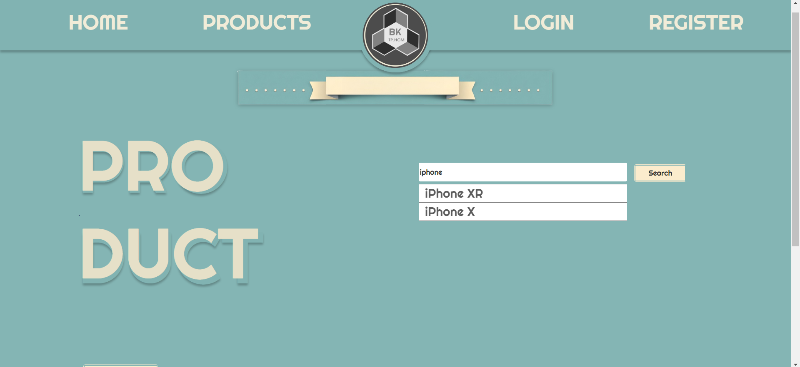
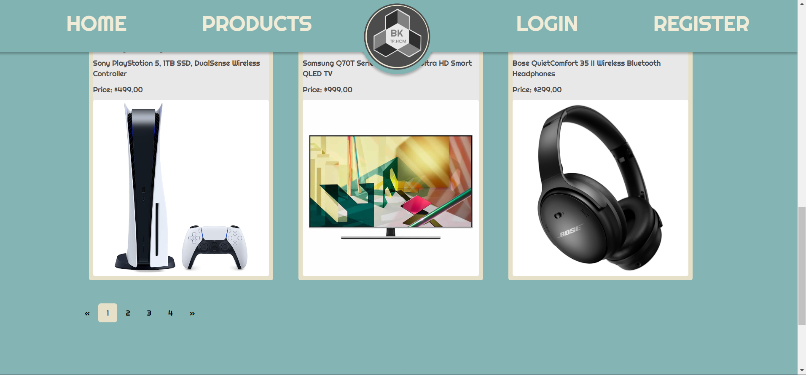

# Web-HTML-PHP-XAMPP
Lab work in HCMUT, HK222 - CO3050
# Using XAMPP
## Version
I am using v3.3.0
## How to run?
1. Looking for '..\xampp\htdocs' folder \n
Add This repo 'Lab' into directory\n
2. On XAMPP Control Panel change config of Apache (httpd.conf)
Find this and change to your dir\n  
DocumentRoot "..\xampp\htdocs\Lab"
<Directory "..\xampp\htdocs\Lab">\n
## UI
[Figma](https://www.figma.com/proto/uaW4UAdOAkX5sk4Kb79hkC/Web-Lab?node-id=1-3)

